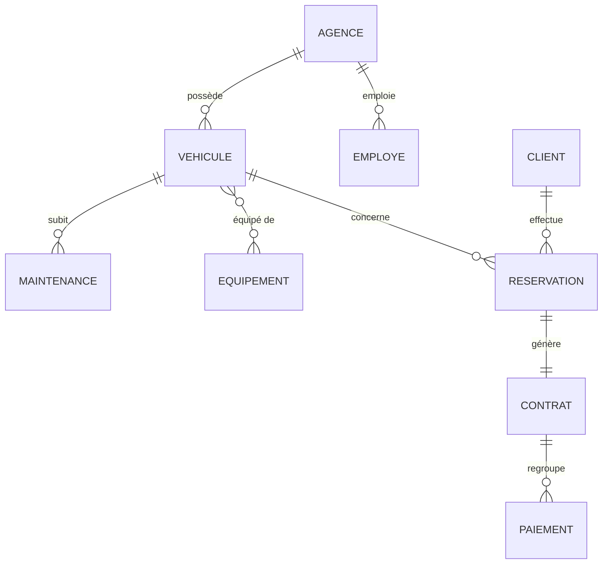

# 🚗 AutoLoc API

**Car-rental management backend** built with Spring Boot — developed as part of my software engineering studies at **ESPRIT** (Tunis).

## 🚀 What it does

Manages the full rental workflow: agencies, vehicles, clients, employees, reservations, contracts, payments, equipment and maintenance — modeled as a normalized relational domain of **10 JPA entities** with complete associations, cascade and fetch strategies.

Current state: complete JPA layer (entities + associations + repositories) with automatic schema generation and seeded demo data. REST controllers and services are the next milestone.

## 🧩 Domain model



| Relation | Mapping | Cascade / Fetch |
|---|---|---|
| Agence → Vehicule / Employe | `@OneToMany` (inverse of `@ManyToOne`) | no cascade, LAZY |
| Vehicule ↔ Equipement | `@ManyToMany` + join table `vehicule_equipement` | LAZY |
| Vehicule → Maintenance | `@ManyToOne` | PERSIST, LAZY |
| Client → Reservation | `@OneToMany` (inverse) | PERSIST |
| Reservation → Client / Vehicule | `@ManyToOne` | LAZY |
| Reservation → Contrat | `@OneToOne` (FK on reservation, unique) | LAZY |
| Contrat → Paiement | `@OneToMany` | cascade ALL + orphanRemoval |

## 🛠️ Technologies

- **Java 17** · **Spring Boot 4.1.1** (Web MVC, Data JPA, Validation)
- **MySQL 8** + Hibernate (auto schema generation)
- **Lombok** · **Maven** wrapper

## 🧰 Getting started

```bash
# Prerequisites: JDK 17+, MySQL 8 running locally
# Default datasource: root / empty password — adjust src/main/resources/application.properties

./mvnw spring-boot:run
```

On first startup the app creates the `autoloc_db` database, generates the schema, and seeds a demo agency, 3 vehicles (Peugeot 208, VW Passat, Toyota RAV4) and equipment.

## ✅ Status & roadmap

- [x] Domain entities (10) + business enums
- [x] Associations: `@OneToMany`, `@ManyToOne`, `@OneToOne`, `@ManyToMany` with cascade/fetch strategies
- [x] Spring Data repositories (Vehicule, Agence, Equipement — more coming)
- [x] Seeded demo data via `CommandLineRunner`
- [ ] Service layer
- [ ] REST controllers + DTOs + bean validation
- [ ] Integration tests

---

Built by [hedi hassan](https://github.com/hadi7250) · ESPRIT
